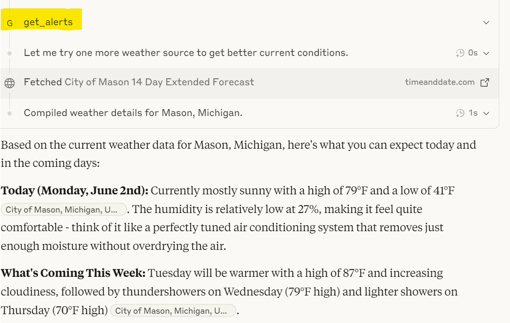
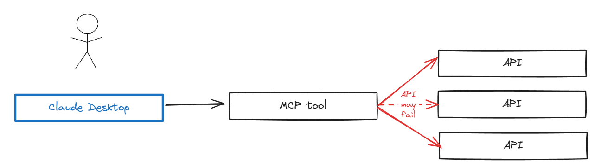
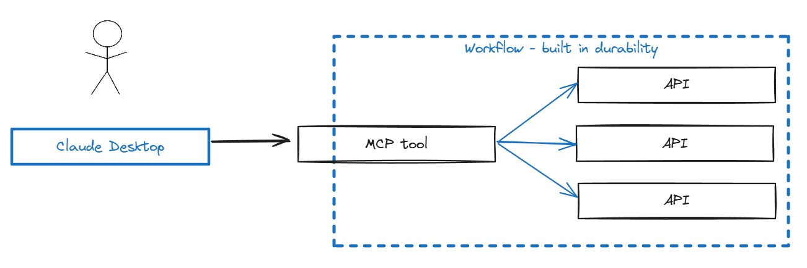

# **Temporal & Durable MCP**

The purpose of this repo is to demonstrate how easy it is to leverage workflows as tools for MCP servers by taking [modelcontext.io's weather example](https://modelcontextprotocol.io/quickstart/server) and making it durable by implementing the MCP tools as Temporal workflows

---

### Prerequisites:

- Python3+
- `uv` (curl -LsSf https://astral.sh/uv/install.sh | sh)
- Temporal [Local Setup Guide](https://learn.temporal.io/getting_started/?_gl=1*1bxho70*_gcl_au*MjE1OTM5MzU5LjE3NDUyNjc4Nzk.*_ga*MjY3ODg1NzM5LjE2ODc0NTcxOTA.*_ga_R90Q9SJD3D*czE3NDc0MDg0NTIkbzk0NyRnMCR0MTc0NzQwODQ1MiRqMCRsMCRoMA..)
- [Claude for Desktop](https://claude.ai/download)

---

### Getting Started

1. First step - clone me
2. `cd temporal-durable-mcp-weather-sample`
3. `uv sync` (create virtual env)
4. `source .venv/bin/activate`
5. Install Temporal: `brew install temporal`
6. Start Temporal Server: `temporal server start-dev &`
7. Start Worker: `python worker.py`
8. Edit your Claude for Desktop Config:
   - Open Claude for Desktop
   - Click `Settings` in the toolbar
   - Click `Developer`
   - Click `Edit Config` (this should open up a finder window that points to a file called `claude_desktop_config.json`)
   - Open the file mentioned above in your editor of choice and modify it to look like the following
     - ```json
       {
         "mcpServers": {
           "weather": {
             "command": "uv",
             "args": [
               "--directory",
               "/ABSOLUTE/PATH/TO/PARENT/FOLDER/temporal-durable-mcp-weather-sample",
               "run",
               "weather.py"
             ]
           }
         }
       }
       ```
   - Restart the Claude app and validate that the tools exposed by the server (`get_alerts`, `get_forecast`) show up in `Search and Tools` by clicking the slider icon in the chat box of Claude for Desktop
9. Ask Claude for any weather alerts and the forecast for a particular city - it should leverage the tools. If it doesn't, try prompting it again encouraging it to use MCP tools that it has access to.

### Results
Here we can see Claude is using the tools intelligently to look for weather alerts while getting me weather information:




#### What's Cool About This
This demonstrates how tools in MCP can be implemented as workflows, adding durability.
Per Claude:
> Traditional MCP tool implementations are like having a single phone conversation - if the line cuts out at any point, you lose everything and have to start over from scratch. When an AI agent is performing complex, multi-step operations (like processing a large dataset, coordinating multiple API calls, or handling a lengthy business process), a single failure anywhere in the chain means complete failure.



>Temporal workflows act like a detailed journal that remembers exactly where you left off. Think of it as having a conversation with someone who takes meticulous notes - even if you both get interrupted and come back hours later, you can pick up exactly where you left off without missing a beat.



This demonstrates what we're calling "tools as workflows" - a tool is implemented as a Temporal Workflow, with the benefits of durability, state management, and retries built in.